Network Architecture & DNS Resolution Guide
---



```mermaid
flowchart LR

    %% ============================================================
    %% CLIENTS
    %% ============================================================

    subgraph CLIENTS["CLIENT DEVICES"]
        direction TB

        TS_CLIENT(["Client<br/>via Tailscale VPN"])
        WG_CLIENT(["Client<br/>via WireGuard VPN"])
    end


    %% ============================================================
    %% PUBLIC DNS
    %% ============================================================

    DUCKDNS[["DuckDNS<br/><br/>*.funkybeefunk.duckdns.org<br/>↓<br/>Tailscale IP"]]


    %% ============================================================
    %% VPN / NETWORK ENTRY
    %% ============================================================

    subgraph NETWORK["VPN / NETWORK ENTRY"]
        direction TB

        TS[/Tailscale network<br/><br/>Split DNS<br/>*.funkybeefunk.duckdns.org/]

        WG[/WireGuard<br/>Docker container/]
    end


    %% ============================================================
    %% BEEFUNK
    %% ============================================================

    subgraph BEEFUNK["DOCKER HOST — beefunk"]
        direction LR

        subgraph PIHOLE["PI-HOLE CONTAINER"]
            direction TB

            DNS{{"Dnsmasq<br/><br/>DNS resolver<br/><br/>*.funkybeefunk.duckdns.org<br/>*.beefunk.lan<br/>↓<br/>Local LAN IP"}}
        end

        TRAEFIK(["Traefik<br/><br/><b>Reverse proxy</b><br/>:80 / :443<br/>TLS termination"])

        subgraph SERVICES["BACKEND DOCKER SERVICES"]
            direction TB

            APP["Application<br/>containers"]
        end
    end


    %% ============================================================
    %% CERTIFICATE AUTHORITY
    %% ============================================================

    LE[["Let's Encrypt<br/>ACME"]]


    %% ============================================================
    %% PUBLIC DNS
    %% ============================================================

    DUCKDNS -.->|"Public DNS record<br/>*.funkybeefunk.duckdns.org → Tailscale IP"| TS


    %% ============================================================
    %% VPN CONNECTIONS
    %% ============================================================

    TS_CLIENT -->|"VPN"| TS
    WG_CLIENT -->|"VPN"| WG


    %% ============================================================
    %% SPLIT DNS
    %% ============================================================

    TS -.->|"Split DNS query"| DNS
    WG -.->|"DNS query"| DNS

    DNS -.->|"DNS response<br/>Local LAN IP"| TS_CLIENT
    DNS -.->|"DNS response<br/>Local LAN IP"| WG_CLIENT


    %% ============================================================
    %% APPLICATION TRAFFIC
    %% ============================================================

    TS_CLIENT ==>|"HTTPS"| TRAEFIK
    WG_CLIENT ==>|"HTTPS"| TRAEFIK

    TRAEFIK -->|"HTTP / HTTPS<br/>proxy"| APP


    %% ============================================================
    %% ACME / CERTIFICATES
    %% ============================================================

    TRAEFIK -.->|"ACME certificate request<br/>for *.funkybeefunk.duckdns.org"| LE

    LE -.->|"TLS certificate"| TRAEFIK


    %% ============================================================
    %% DARK MODE STYLING
    %% ============================================================

    classDef client fill:#26384a,stroke:#64b5f6,stroke-width:2px,color:#ffffff
    classDef network fill:#332b4a,stroke:#b39ddb,stroke-width:2px,color:#ffffff
    classDef pihole fill:#203d2b,stroke:#66bb6a,stroke-width:2px,color:#ffffff
    classDef dns fill:#4a3b18,stroke:#ffd54f,stroke-width:2px,color:#ffffff
    classDef proxy fill:#4a2e18,stroke:#ffb74d,stroke-width:2px,color:#ffffff
    classDef backend fill:#303030,stroke:#bdbdbd,stroke-width:2px,color:#ffffff
    classDef external fill:#45263a,stroke:#f48fb1,stroke-width:2px,color:#ffffff

    class TS_CLIENT,WG_CLIENT client
    class TS,WG network
    class DUCKDNS,LE external
    class PIHOLE pihole
    class DNS dns
    class TRAEFIK proxy
    class APP backend
```

# Network Architecture: Traefik, Pi-hole, Tailscale & Wireguard
┌───────────────────────────────┐     ┌───────────────────────────────┐
│         Client Device         │     │         Client Device         │
│     (Via Tailscale VPN)       │     │      (Via Wireguard VPN)      │
└──────────────┬────────────────┘     └──────────────┬────────────────┘
               │                                     │
               │ (Points to Tailscale IP)            │ (Connects to WG Port)
               ▼                                     ▼
┌───────────────────────────────┐     ┌───────────────────────────────┐
│       Tailscale Network       │     │    Wireguard Docker Container │
│ • Split DNS Nameserver:       │     │    (Running on Host Server)   │
│   *.funkybeefunk.duckdns.org  │     │ • Uses Pi-hole Docker IP for  │
│   ──► Forwards to Pi-hole     │     │   internal DNS resolution     │
└──────────────┬────────────────┘     └──────────────┬────────────────┘
               │                                     │
               └──────────────────┬──────────────────┘
                                  │
                                  ▼
┌─────────────────────────────────────────────────────────────────────┐
│                 Docker Host Server ("beefunk")                      │
│                                                                     │
│  ┌───────────────────────────────┐         ┌─────────────────────┐  │
│  │ Pi-hole Container + Dnsmasq   │         │       Traefik       │  │
│  │ (Docker Container IP)         │         │  (Reverse Proxy &   │  │
│  │ • Matches:                    │         │   ACME SSL Handler) │  │
│  │   *.funkybeefunk.duckdns.org  │         │                     │  │
│  │ • Resolves to: Local LAN IP   │         │                     │  │
│  └──────────────┬────────────────┘         └──────────┬──────────┘  │
│                 │                                     │             │
│                 │ (DNS Resolution Answer)             │ (Proxy Req) │
│                 └──────────────────┬──────────────────┘             │
│                                    ▼                                │
│                     [ Backend Docker Services ]                     │
└─────────────────────────────────────────────────────────────────────┘
                                     │
                                     │ (Certificate Challenge: 
                                     │  TLS-ALPN / HTTP-01 or DNS-01)
                                     ▼
                        ┌─────────────────────────┐
                        │  Let's Encrypt (ACME)   │
                        └─────────────────────────┘


## Overview
This infrastructure routes internal and external traffic for `*.funkybeefunk.duckdns.org` and `*.beefunk.lan` securely to your Docker host server running Traefik and Pi-hole.

Traffic & Resolution Flow
1. External / VPN Entry Points:

  • Tailscale: DuckDNS points to your Tailscale IP. Tailscale Split DNS forwards `*.funkybeefunk.duckdns.org` queries directly to Pi-hole.

  • Wireguard: A Docker container running on the host server configured to use the Pi-hole container IP for internal DNS resolution.

2. DNS Interception (Pi-hole + Dnsmasq):

  • Dnsmasq matches requests for `*.beefunk.lan` and `*.funkybeefunk.duckdns.org` and resolves them directly to the Local LAN IP of the server, avoiding external routing latency.

3. Reverse Proxy & SSL (Traefik & ACME):

  • Traefik receives traffic on ports 80/443, handles automatic SSL/TLS certificate generation via Let's Encrypt (ACME) (using HTTP-01, TLS-ALPN, or DNS-01 challenges), and routes requests to the appropriate backend Docker services.

---

## Useful Diagnostic Commands
1. Test DNS Resolution via Pi-hole

Check how a specific domain resolves when querying your Pi-hole directly:

```

nslookup app.funkybeefunk.duckdns.org <PIHOLE_DOCKER_IP>

```

Or using `dig`:

```

dig @<PIHOLE_DOCKER_IP> app.funkybeefunk.duckdns.org

```

2. Verify Local Resolution on Host

```

dig app.funkybeefunk.duckdns.org +short

```

3. Check Traefik Container Logs

To inspect routing, incoming requests, or ACME certificate issuance errors:

```

docker logs -f traefik

```

4. Check Pi-hole / Dnsmasq Logs

To see if Dnsmasq is properly intercepting your wildcard domains:

```

docker logs -f pihole | grep dnsmasq

```
